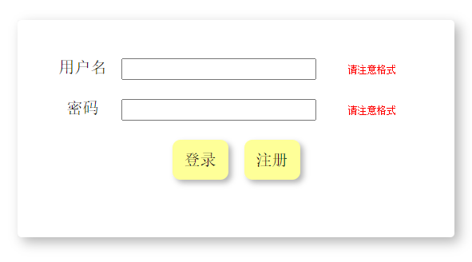

# JUI 示例教程

## 前言

使用前请在网页<head></head>中引入 **jui/css/jui.css** 文件、**jui/jui.js** 文件

```html
<link rel="stylesheet" type="text/css" href="jui/css/jui.css"/>
<script src="jui/jui.js"></script>
```

## 页面布局


```html
<div class="jui-body">
    <div class="jui-body-top">
        <div class="jui-test-div">				
            这里是TOP
        </div>
    </div>
    <div class="jui-body-middle">
        <div class="jui-body-middle-left">
            <div class="jui-test-div">
                这里是MIDDLE-LEFT<br>
                大小随内容变化
            </div>
        </div>	
        <div class="jui-body-middle-middle">
            <div class="jui-test-div">
                这里是MIDDLE-MIDDLE<br>
                大小随内容变化
            </div>
        </div>	
        <div class="jui-body-middle-right">
            <div class="jui-test-div">
                这里是MIDDLE-RIGHT<br>
                大小随内容变化
            </div>
        </div>	
    </div>			
    <div class="jui-body-bottom">
        <div class="jui-test-div">
            这里是BOTTOM
        </div>
    </div>			
</div>		
```

## 对齐方式


```html
<div class="jui-inside-horizontal">
    <div class="jui-outside-left">
        <div class="jui-test-div">左对齐</div>
    </div>
    <div class="jui-outside-center">
        <div class="jui-test-div">居中</div>             
    </div>
    <div class="jui-outside-right">
        <div class="jui-test-div">右对齐</div>    
    </div>
</div>
```

## 导航

### 顶部导航


```html
<div class="jui-inside-horizontal">
    <div class="jui-outside-center">
        <ul class="jui-ul-navbar" style="width: 1400px;">
            <div class="jui-outside-left jui-inside-horizontal">
                <li><a href="login.jsp">首页</a></li>
            </div>
            <div class="jui-outside-right jui-inside-horizontal">
                <li><a href="login.jsp">登录</a></li>
                <li><a href="login.jsp">注册</a></li>
            </div>
        </ul>
    </div>
</div>
```
## input标签

### 搜索


```html
<!--jui.search(this,跳转的参数名,跳转的路由,event)；回车跳转-->
<input class="jui-input-search" type="text" placeholder="搜索..." onkeydown="jui.search(this,'search','index.html',event)"/>
```
### 日期选择


```html
<!--jui.dateSelect(id),设置默认日期为今天-->
<input class="jui-input-search" type="date" name="" id="dateSlect"/><script>jui.dateSelect('dateSlect')</script>
```
## 按钮


```html
<button type="button" class="jui-btn btn-dark">黑色</button>
<button type="button" class="jui-btn btn-danger">红色</button>
<button type="button" class="jui-btn btn-secondary">灰色</button>
```
## 文件上传


```html
<form action="/" method="post" enctype="multipart/form-data">
    <button type="button" class="jui-btn btn-dark" onclick="jui.fileSelect('file',this)">选择文件</button>
    <input type="file" style="display: none;" name="file" id="file"/>
    <button type="submit" class="jui-btn btn-dark">上传文件</button>
</form>
```
## 表格


## 分页


```html
<div class="jui-row">
    <div class="jui-outside-center" id="paging">
        <!-- jui.paging()有四个参数，第一个时div的id，第二个是当前页面，第三个是总页面，第四个是要跳转的路由，跳转带有currentPage属性是目标页码 -->
        <script>jui.paging('paging',5,10,'#')</script>
    </div>
</div>
```
## 登录界面



```html
<div class="jui-login-div">
    <form class="" action="" method="post" onsubmit="check()" onreset="clear_tip()">
        <div class="">
            <label>用户名</label>
            <input type="text" class="" name="username" id="username">
            <div><span id="username_tip">请注意格式</span></div>
        </div>
        <div class="">
            <label>密码</label>
            <input type="password" class="" name="password" id="password">
            <div><span id="password_tip">请注意格式</span></div>
        </div>
        <div class="">
            <div>
                <button type="submit" onclick="">登录</button>
                <a href="#"><button type="reset">注册</button></a>
            </div>
        </div>
    </form>
</div>
```

## 动画

### 动画-1


```html
<div class="jui-div-animation-1-100px">
    
</div>
```

