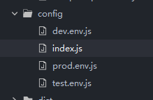
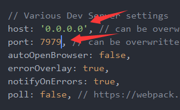

##  Nodejs 10.x 安装

1. 执行nodejs安装文件后，将安装目录`C:\Program Files\nodejs\`写进环境变量

2. 在命令行，安装淘宝镜像

```cmd
npm install -g cnpm --registry=https://registry.npm.taobao.org
```

3. cmd进入你期望的目录下载vue

> 注意不要下在管理员权限的目录下
>
> 将C:\Users\jyd\AppData\Roaming\npm\node_modules\\.bin设置进环境变量
>
> 环境变量修改后，需要重新打开cmd

```cmd
cnpm install vue-cli
```


## 创建一个vue项目

4. 新建一个文件夹 vue-workspace，cmd进入该文件夹，输入下列命令

```cmd
vue init webpack 项目名
```

5. 输入项目名，后面一直回车即可，等待下载完即可

6. ，进入 项目 目录，启动

```cmd
cd 项目名
npm run dev
```

## vue目录结构

### config

  

index.js 文件中修改地址和端口 ，host改成IP形式才支持远程