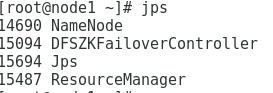

# Centos7 Hadoop3.x安装配置

​    Hadoop是一个由Apache基金会所开发的[分布式系统](https://baike.baidu.com/item/分布式系统/4905336)基础架构。用户可以在不了解分布式底层细节的情况下，开发分布式程序。充分利用集群的威力进行高速运算和存储。Hadoop实现了一个[分布式文件系统](https://baike.baidu.com/item/分布式文件系统/1250388)（Hadoop Distributed File System），其中一个组件是HDFS。HDFS有高[容错性](https://baike.baidu.com/item/容错性/9131391)的特点，并且设计用来部署在低廉的（low-cost）硬件上；而且它提供高吞吐量（high throughput）来访问[应用程序](https://baike.baidu.com/item/应用程序/5985445)的数据，适合那些有着超大数据集（large data set）的应用程序。HDFS放宽了（relax）POSIX的要求，可以以流的形式访问（streaming access）文件系统中的数据。Hadoop的框架最核心的设计就是：[HDFS](https://baike.baidu.com/item/HDFS/4836121)和[MapReduce](https://baike.baidu.com/item/MapReduce/133425)。HDFS为海量的数据提供了存储，而MapReduce则为海量的数据提供了计算 。

## 环境需求

1. [JDK安装](https://www.cnblogs.com/sxdcgaq8080/p/7492426.html)
2. 安装SSH
3. [zookeeper安装配置](https://blog.csdn.net/qq_44278517/article/details/107726073)

## Haddop 下载

1. [选择版本](http://mirrors.hust.edu.cn/apache/hadoop/common/)

2. 选择好安装目录，在该目录下使用 **wget** 下载，这里使用的是 **~/soft/**

```
wget http://mirrors.hust.edu.cn/apache/hadoop/common/hadoop-3.3.0/hadoop-3.3.0.tar.gz
```


3. 使用 **tar** 解压

```
tar -zxvf hadoop-3.3.0.tar.gz
```

## 完全分布式环境配置

> 这里使用了3个节点，node1，node2，node3
>
> IP分别是：192.168.83.130，192.168.83.129，192.168.83.131
>
> **若无说明则默认该操作在 node1 上配置**

### 集群规划

| IP             | HostName | 用途                               | 安装软件         |
| -------------- | -------- | ---------------------------------- | ---------------- |
| 192.168.83.130 | node1    | NameNode1                          | hadoop,zookeeper |
| 192.168.83.129 | node2    | NameNode1，DateNode1，JournalNode1 | hadoop,zookeeper |
| 192.168.83.131 | node3    | DateNode2，JournalNode1            | hadoop,zookeeper |

### 配置SSH免密登录，IP别名

1. 配置IP别名

   ```
   vim /etc/hosts
   ```

   ```
   192.168.83.129 node2
   192.168.83.130 node1
   192.168.83.131 node3
   ```

2. 生成密钥，dsa 是密钥类型，还有个默认的rsa

   ```
   ssh-keygen -t dsa
   ```

3. 发送公钥给其他节点（包括自己），需要输入被登录节点的登陆密码

   ```
   ssh-copy-id -i ~/.ssh/id_dsa.pub root@node1
   ssh-copy-id -i ~/.ssh/id_dsa.pub root@node2
   ssh-copy-id -i ~/.ssh/id_dsa.pub root@node3
   ```

4. 测试连接

   ```
   ssh node2
   exit
   ssh node3
   exit
   ```

   

5. 使用 scp 将 /etc/hosts 复制给其他节点

   ```
   scp /etc/hosts root@node2:/etc/hosts
   scp /etc/hosts root@node3:/etc/hosts
   ```

6. 在其他节点重复上面3个步骤

### 配置环境变量

```
vim /etc/profile
```

​			1）然后在末尾添上下面文本：

```
export HADOOP_HOME=~/soft/hadoop-3.3.0
export PATH=$PATH:$HADOOP_HOME/bin:$HADOOP_HOME/sbin
```

​			2）立即生效

```
source /etc/profile
```

​			3）然后就可以使用 **hadoop** 命令了


### 配置 **Hadoop** 文件

1. 为了便于管理，给 **Master的hdfs的NameNode、DataNode及临时文件** 分别创建1个目录：

```
cd ~soft/hadoop-3.3.0
mkdir hdfs
cd hdfs
mkdir name
mkdir data
mkdir tmp
cd ../
mkdir journal
cd journal
mkdir data
```

2. 进入 **~/soft/hadoop-3.3.0/etc/hadoop/** 目录，依次修改core-site.xml、hdfs-site.xml、mapred-site.xml、yarn-site.xml以及workers文件。

3. 修改 **core-site.xml** ，在<configuration></configuration>中添加以下文本：

   > **fs.defaultFS** 为 **NameNode** 的地址。
   >
   > **hadoop.tmp.dir** 为 **hadoop 临时目录**的地址，默认情况下，NameNode 和 DataNode 的数据文件都会存在这个目录下的对应子目录下。应该保证此目录是存在的，如果不存在，先创建。

```xml
    <!-- hdfs的nameservice为jyd -->
    <property>
        <name>fs.defaultFS</name>
        <value>hdfs://jyd</value>
    </property>
    
    <!--指定hadoop数据临时存放目录-->
    <property>
        <name>hadoop.tmp.dir</name>
        <value>/root/soft/hadoop-3.3.0/hdfs/tmp</value>
    </property>
    
    <!--指定zookeeper地址-->
    <property>
        <name>ha.zookeeper.quorum</name>
        <value>node1:2181,node2:2181,node3:2181</value>
    </property>
```


4. 修改 **hdfs-site.xml** 

   > **dfs.namenode.secondary.http-address** 是指定 secondaryNameNode 的 http 访问地址和端口号，因为在规划中，我们将 **node2 规划为 **SecondaryNameNode 服务器**。
   >
   > 所以这里设置为：node2:50070

```xml
    <!--指定hdfs的nameservice为jyd，需要和core-site.xml中的保持一致-->
    <property>
        <name>dfs.nameservices</name>
        <value>jyd</value>
    </property>

    <!--jyd下面有2个NameNode，node1,node2-->
    <property>
        <name>dfs.ha.namenodes.jyd</name>
        <value>node1,node2</value>
    </property>

    <!--node1的RPC通信地址-->
    <property>
        <name>dfs.namenode.rpc-address.jyd.node1</name>
        <value>node1:9000</value>
    </property>

    <!-- node1 的http通信地址-->
    <!--Hadoop3开始http默认端口已经改为9870，这里为了兼容之前的，还是设置成50070-->
    <property>
        <name>dfs.namenode.http-address.jyd.node1</name>
        <value>node1:50070</value>
    </property>

	<!--node2的RPC通信地址-->
    <property>
        <name>dfs.namenode.rpc-address.jyd.node2</name>
        <value>node2:9000</value>
    </property>

    <!-- node2 的http通信地址-->
    <!--Hadoop3开始http默认端口已经改为9870，这里为了兼容之前的，还是设置成50070-->
    <property>
        <name>dfs.namenode.http-address.jyd.node2</name>
        <value>node2:50070</value>
    </property>

    <!--指定NameNode的元数据在JournalNode上的存放位置-->
    <property>
        <name>dfs.namenode.shared.edits.dir</name>
        <value>qjournal://node2:8485;node3:8485/jyd</value>
    </property>

    <!--指定JournalNode在本地磁盘存放数据的位置-->
    <property>
        <name>dfs.journalnode.edits.dir</name>
        <value>/root/soft/hadoop-3.3.0/journal/data</value>
    </property>

    <!--开启NameNode故障时自动切换-->
    <property>
        <name>dfs.ha.automatic-failover.enabled</name>
        <value>true</value>
    </property>

    <!--配置失败自动切换实现方式-->
    <property>
        <name>dfs.client.failover.proxy.provider.jyd</name>
        <value>org.apache.hadoop.hdfs.server.namenode.ha.ConfiguredFailoverProxyProvider</value>
    </property>

    <!--配置隔离机制，如果ssh是默认22端口，value直接写sshfence即可-->
    <!--如果不是22端口，则写sshfence(hadoop:22022)，其中22022为新的ssh端口号-->
    <property>
        <name>dfs.ha.fencing.methods</name>
        <value>sshfence</value>
    </property>

    <!--使用隔离机制时需要ssh免登陆-->
    <property>
        <name>dfs.ha.fencing.ssh.private-key-files</name>
        <value>/root/.ssh/id_dsa</value>
    </property>

    <!--namenode中name数据存放目录-->
    <property>
        <name>dfs.namenode.name.dir</name>
        <value>file:/root/soft/hadoop-3.3.0/hdfs/name</value>
    </property>

    <!--datanode数据存放目录-->
    <property>
        <name>dfs.datanode.data.dir</name>
        <value>file:/root/soft/hadoop-3.3.0/hdfs/data</value>
    </property>

    <!--数据备份数量-->
    <property>
        <name>dfs.replication</name>
        <value>2</value>
    </property>

    <!-- 在NN和DN上开启WebHDFS (REST API)功能,不是必须 -->
    <property>
        <name>dfs.webhdfs.enabled</name>
        <value>true</value>
    </property>
```

5. 修改 **mapred-site.xml**

   > **mapreduce.framework.name** 设置 mapreduce 任务运行在 yarn 上。

```xml
    <property>
        <name>mapreduce.framework.name</name>
        <value>yarn</value>
    </property>
```

6. 修改 **yarn-site.xml**


```xml
    <!--指定 nodemanager 启动时加载 server 的方式为shuffle server-->
    <property>
    <name>yarn.nodemanager.aux-services</name>
    <value>mapreduce_shuffle</value>
    </property>

    <property>
    <name>yarn.nodemanager.aux-services.mapreduce_shuffle.class</name>
    <value>org.apache.hadoop.mapred.ShuffleHandler</value>
    </property>

    <!--ResourceManager 高可用激活-->
    <property>
    <name>yarn.resourcemanager.ha.enabled</name>
    <value>true</value>
    </property>

    <!--定义集群的ID,确保RM不会在其他集群中接管成为活跃RM-->
    <property>
    <name>yarn.resourcemanager.cluster-id</name>
    <value>jyd</value>
    </property>

    <property>
    <name>yarn.resourcemanager.ha.rm-ids</name>
    <value>jydrm1,jydrm2</value>
    </property>

    <property>
    <name>yarn.resourcemanager.hostname.jydrm1</name>
    <value>node1</value>
    </property>

    <property>
    <name>yarn.resourcemanager.webapp.address.jydrm1</name>
    <value>node1:8088</value>
    </property>

	<property>
    <name>yarn.resourcemanager.hostname.jydrm2</name>
    <value>node2</value>
    </property>

    <property>
    <name>yarn.resourcemanager.webapp.address.jydrm2</name>
    <value>node2:8088</value>
    </property>

    <property>
    <name>yarn.resourcemanager.zk-address</name>
    <value>node1:2181,node2:2181,node3:2181</value>
    </property>
```

7. 修改**workers** 文件

   > **workers文件**是指定 HDFS 上有哪些 DataNode 节点。

```
vim workers
```

```
#删除其他内容
node2
node3
```

8. 修改 **hadoop-env.sh** 文件

```
vim hadoop-env.sh
```

> 在文件空白处加入下面的代码

```
export JAVA_HOME=/usr/java/jdk-14.0.2
```

9. 进入 **~/soft/hadoop-3.3.0/sbin** 修改 **start-dfs.sh**，**start-yarn.sh** 文件

   1）修改 **start-dfs.sh**

   ```
   vim ~/soft/hadoop-3.3.0/sbin/start-dfs.sh
   ```

   ```
   #添加在开头
   HDFS_DATANODE_USER=root
   HADOOP_SECURE_DN_USER=hdfs
   HDFS_NAMENODE_USER=root
   HDFS_SECONDARYNAMENODE_USER=root 
   HDFS_JOURNALNODE_USER=root
HDFS_ZKFC_USER=root
   ```

   2）修改 **start-yarn.sh**
   
   ```
vim ~/soft/hadoop-3.3.0/sbin/start-yarn.sh
   ```
   
   ```
   YARN_RESOURCEMANAGER_USER=root
   HADOOP_SECURE_DN_USER=yarn
   YARN_NODEMANAGER_USER=root
   ```

### 配置其他节点

1. 使用 scp 将Hadoop分发给其他节点，因为复制的是文件夹，所以使用 -r

   > Hadoop 根目录下的 share/doc 目录是存放的 hadoop 的文档，文件相当大，建议在分发之前将这个目录删除掉，可以节省硬盘空间并能提高分发的速度。

   ```
   scp -r ~/soft/hadoop-3.3.0 root@ndoe2:~/soft/
   scp -r ~/soft/hadoop-3.3.0 root@ndoe3:~/soft/
   ```

### 启动 Hadoop 集群

1. 在 node2，node3 启动 zookeeper

   ```
   zkServer.sh start
   ```

2. 在 node2，node3 启动 JournalNode（第一次启动需要做的）

   ```
   hadoop-daemon.sh start journalnode
   ```

3. 在 **主NameNode** node1上进行 namenode ，journalnode 格式化（第一次启动需要做的）

   > 注意格式化之前需要将，各个节点上与下面对应的目录下的文件都删掉，保持empty
   >
   > /root/soft/hadoop-3.3.0/hdfs/name/ 
   >
   > /root/soft/hadoop-3.3.0/hdfs/tmp/ 
   >
   > /root/soft/hadoop-3.3.0/journal/data/

   ```
   hdfs namenode -format
   ```

4. 在主**NamNode**使用 start-all.sh 启动集群

   ```
   start-all.sh
   ```

5. 查询节点启用的功能

   ```
   jps
   ```

   

6. 查询 NameNode 的状态

   ```
   hdfs haadmin -getAllServiceState
   ```

   

7. 目前node2 的namenode未启用成功可以尝试 将node1也加入到zookeeper中
8. 

