# 合成

## 段晶

### 武器

#### 马尔杜拉

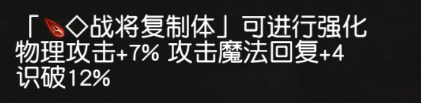

#### 堕天泡泡

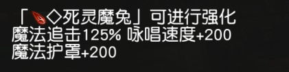

#### 暗龙芬斯坦

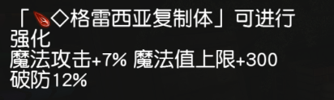

#### 怪穆尔

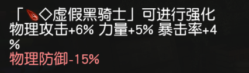

### 防具

#### 奥恩拉夫

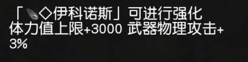

#### 兔美

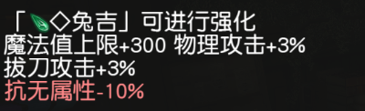

#### 漂漂妈

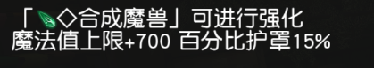

#### 诺耶莉尔冰雕

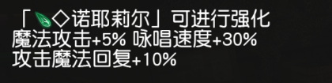

### 追加

#### 皮多大王

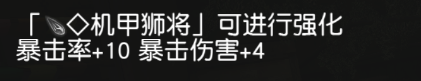

#### 柔艾

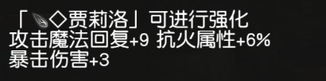

#### 放浪魔轮

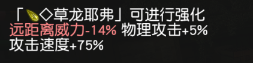

#### 巴疯魔

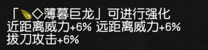

### 特殊

#### 泽雷萨乌迦

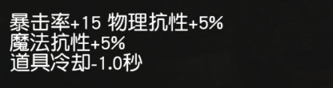

#### 魔偶

#### 薇內娜

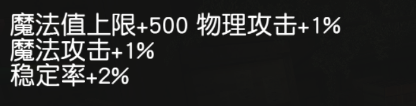

#### 魔晶炮手

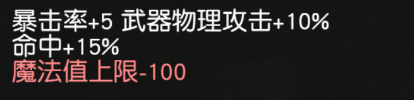

#### 齐尔布兹

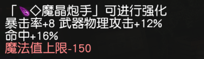

### 通用

#### 休斯古巨兽

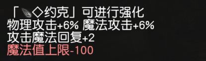

