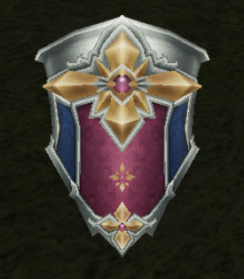

# 定点BOSS

> 随着星级的增加，boss的HP，经验也随之增加，2星2倍，3星5倍，4星10倍
>
> 但是等级是：2星+10，3星+20，4星+40

| 名称       | 基础等级       | 信息                                                    | 地点              |
| ---------- | -------------- | ------------------------------------------------------- | ----------------- |
| 地狱三头犬 | 97             |                                                         |                   |
| 合成魔兽   | 112【建议108】 |  | 烧灼裂谷 · 最深处 |
|            |                |                                                         |                   |

# 地图信息

## 艾利路丹街道

| 怪物名称 | 等级    | 能否作为宠物                                            | 掉落材料                                                     | 掉落装备                                                     | 装备外观                                                     | 描述 |
| -------- | ------- | ------------------------------------------------------- | ------------------------------------------------------------ | ------------------------------------------------------------ | ------------------------------------------------------------ | ---- |
| 蜂蚁     | 155     |  | 坚硬虫翅【布料】 尖锐毒针【金属】 美味蜂蜜【药品】 | 旋风枪                                                       |                                                              |      |
| 咪悠     | 155     |  | 轻柔软毛【兽品】 棒棒尾【兽品】 香菜【药品】       | 旅行水壶 【追加】基础物防39 MP上限+300，仇恨-15% 对火+9%，抗火+18% |  |      |
| 罗甲     | 156     | 否                                                      | 甲壳青苔【药品】 艾利路丹木材【木材】 美丽玳瑁【魔素】 | 和谐盾牌 【盾】基础物防39 格挡率+26%，格挡力+26% 物理抗性+10%，魔法抗性+10% |  |      |
| 拉叶爪狼 | 156~157 | 否                                                      | 人狼兽毛【兽品】 人狼兽牙【兽品】 月之石【魔素】   | 单手                                                         |                                                              |      |

## 瓦吉罗街道

| 怪物名称         | 等级 | 能否作为宠物                                                 | 掉落材料                                                     | 掉落装备                                                     | 装备外观                                                     | 描述 |
| ---------------- | ---- | ------------------------------------------------------------ | ------------------------------------------------------------ | ------------------------------------------------------------ | ------------------------------------------------------------ | ---- |
| 污浊泥怪【头目】 | 195  | 否                                                           | 诡异稠状物【药品】 瓦吉罗石材【金属】 秘银矿石【金属】 特殊段晶【魔素】 | 艾克翠斯拳剑 【拳】基础物攻222 暴击+75，爆伤+25 识破15% 抗无+15%，对暗-50% |  |      |
| 浊泥怪           | 145  | 否                                                           | 绿色粘稠物【药品】 诡异稠状物【药品】 瓦吉罗石材【金属】 | 追加                                                         |                                                              |      |
| 青蓝蛙           | 142  |  | 膨胀腹皮【布料】 蛙肉【药品】 蓝色幸运物【魔素】   | 追加                                                         |                                                              |      |
| 郁香             | 144  |  | 结实的茎【药品】 大型块根【药品】 美味蜂蜜【药品】 命中+12【魔素】 | 无                                                           |                                                              |      |

## 众神之殿

| 怪物名称 | 等级 | 能否作为宠物                                                 | 掉落材料                                                     | 掉落装备                                                     | 装备外观                                                | 描述        |
| -------- | ---- | ------------------------------------------------------------ | ------------------------------------------------------------ | ------------------------------------------------------------ | ------------------------------------------------------- | ----------- |
| 袋熊爹   | 144  |  |  |  |  | 分布：第4区 |

