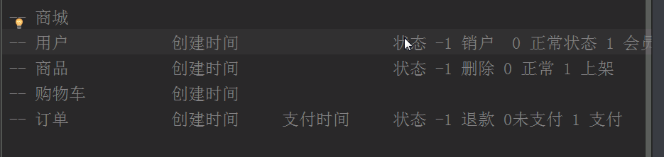
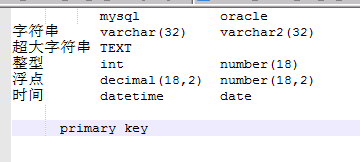

#### 作业：

- 数据库表字典：

- 建表：

#### 笔记：

线程同步：

> 一个共享资源同时被多个线程访问

- 数据库锁
- java锁
- redis锁

反射：

- 反编译常用

Oracle数据库：

- 默认端口1521（MySQl是3306、SQLServer是1433）
-  

MySQL数据库：

- 每个表都要有一个主键，主键的类型一般都是自增的int型（也可以使用UUID生成唯一字符串）
- 数据库表三大范式：
  - 第一范式
  - 第二范式
  - 第三范式

