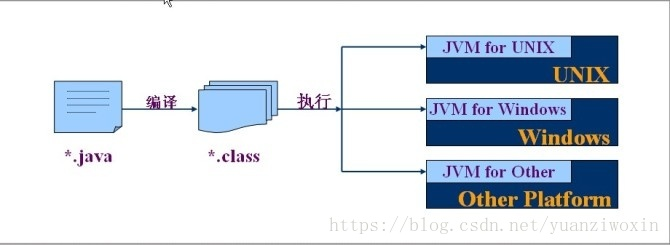

- # 1. Java 基础知识

  [JAVA教程](https://www.liaoxuefeng.com/wiki/1252599548343744)

  ## 1.1 Java 俩大数据类型

  ### 1.1.1 内置数据类型

  四种整形类型：byte（8bit）， short（16bit）， int（32bit）， long（64bit）

  两种浮点数类型：float（双精度32bit）， double（双精度64bit）

  一种字符类型：char（16bit）

  一种布尔类型：boolean（1bit）

  ### 1.1.2 引用数据类型

  - 在Java中，引用类型的变量非常类似于C/C++的指针。引用类型指向一个对象，指向对象的变量是引用变量。这些变量在声明时被指定为一个特定的类型，比如 Employee、Puppy 等。变量一旦声明后，类型就不能被改变了。
  - 对象、数组都是引用数据类型。
  - 所有引用类型的默认值都是null。
  - 一个引用变量可以用来引用任何与之兼容的类型。
  - 例子：Site site = new Site("Runoob")。

  ### 1.1.3 类型默认值

  下表列出了 Java 各个类型的默认值：

  | **数据类型**           | **默认值** |
  | :--------------------- | :--------- |
  | byte                   | 0          |
  | short                  | 0          |
  | int                    | 0          |
  | long                   | 0L         |
  | float                  | 0.0f       |
  | double                 | 0.0d       |
  | char                   | 'u0000'    |
  | String (or any object) | null       |
  | boolean                | false      |

  

  # 2. 编译性语言和解释性语言的区别 

  ## 1、编译性语言

  - （1）**只须编译一次**就可以把源代码编译成机器语言，后面的执行**无须重新编译**，直接使用之前的编译结果就可以；因此其**执行的效率比较高**；
  - （2）编译性语言代表：C、C++、Pascal/Object Pascal（Delphi）；
  - （3）程序执行效率比较高，但比较依赖编译器，因此跨平台性差一些；

  > **不同平台对编译器影响较大**。 
  > 如：
  >
  > - （1）16位系统下int是2个字节（16位），而32位系统下int占4个字节（32位）；
  > - （2）32位系统下long类型占4字节，而64位系统下long类型占8个字节；

  ## 2、解释性语言

  - （1）源代码不能直接翻译成机器语言，而是先翻译成中间代码，再由解释器对中间代码进行解释运行；

  > 源代码—>中间代码—>机器语言

  - （2）程序不需要编译，程序在运行时才翻译成机器语言，每执行一次都要翻译一次；
  - （3）解释性语言代表：Python、JavaScript、Shell、Ruby、MATLAB等；
  - （4）运行效率一般相对比较低，依赖解释器，**跨平台性好**；

  ## 3、比较

  - （1）**一般**，编译性语言的运行效率比解释性语言更**高**；但是不能一概而论，部分解释性语言的解释器通过在**运行时动态优化**代码，甚至能使解释性语言的性能超过编译性语言；
  - （2）编译性语言的跨平台特性比解释性语言**差**一些；

  ## 4、java是编译性语言还是解释性语言？

  对于这个问题，网上是众说纷纭；有人说是编译性语言，也有人说是解释性语言。但是个人觉得正如一位网友所说的那样，解释性或编译性和语言本身是没有关系的，即解释性或编译性可以看作是一种语言的状态；

  - java语言应是编译性-解释性语言，因为其同时具备编译性和解释性两种特性；

  > java文件先编译成**与平台无关的.class的字节码文件**，然后.class的字节码文件既可以在Windows平台上的java虚拟机（JVM）上进行解释运行，也可以在Linux平台上的JVM上解释运行；而JVM的翻译过程时解释性的，JVM从.class的字节码文件中**读出一条指令，翻译一条指令，然后执行一条指令**，这个过程就称为**java的解释执行**；

  

  

   

  # 3. 利用cmd控制台运行Java程序

  > 新建一个文本文件，保存为 .java 文件，文件名 JavaDemo.java
  >
  > 内容如下：
  >
  > ```java
  > public class JavaDemo{
  > 	public static void main(String[] args){
  > 		System.out.println("哈喽！！！");
  > 	}
  > }
  > ```
  >
  > 注意：文件名一定要与 类名JavaDemo 相同，
  >
  > 进入cmd控制台使用 javac 命令编译.java文件，生成.class文件；利用 java 命令运行.class文件
  >
  > ```cmd
  > javac JavaDemo.java
  > java JavaDemo
  > ```

  > cmd控制台一般是 ANSI 编码，若java文件保存的其他编码，中文可能会乱码导致编译错误
  >
  > 编程习惯：类名每个单词首字母大写；变量名，方法名首单词的首单词小写，其他单词首字母大写

  # 4. 编程规范

  > 编程习惯：类名每个单词首字母大写；变量名，方法名首单词的首单词小写，其他单词首字母大写，静态变量全大写
  >
  > 一个java文件中只能有一个 public class（公共类），能有多个 class（内部类），Java文件名与公共类名必然相同

  

  # 5. Java重要机制

  ## 5.1 JVM

  https://www.jianshu.com/p/76959115d486

  ## 5.2 JC

  

  
